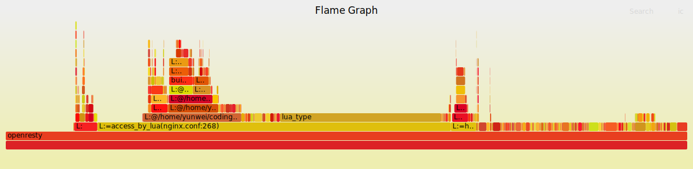
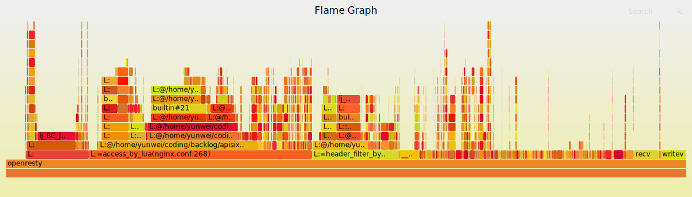

# ebpf-based lua profile tools

Use ebpf to generate lua flamegraphs:

- trace lua stack in kernel
- zero code changes or restarts needed
- support `luajit 32/luajit 64`
- working well on new kernel(>=5.13)
- faster speed
- run only a small binary without any dependencies

> Note: 
> - for the ebpf verifier instructions limit in kernel, the stack-trace deepth is limited to top 15 in lua. If you need to trace deeper, you need to use systemtap instead.
> - this project is not finished yet, and some errors may occurred.

## probe lua stack in nginx

see: bpftools/profile_nginx_lua/profile.bpf.c

first, we use `uprobe` in ebpf to attach to `libluajit.so` get the lua_State:

```c
static int probe_entry_lua(struct pt_regs *ctx)
{
	if (!PT_REGS_PARM1(ctx))
		return 0;

	__u64 pid_tgid = bpf_get_current_pid_tgid();
	__u32 pid = pid_tgid >> 32;
	__u32 tid = (__u32)pid_tgid;
	struct lua_stack_event event = {};

	if (targ_pid != -1 && targ_pid != pid)
		return 0;
	// event.time = bpf_ktime_get_ns();
	event.pid = pid;
	// bpf_get_current_comm(&event.comm, sizeof(event.comm));
	event.L = (void *)PT_REGS_PARM1(ctx);
	// bpf_printk("lua_state %p\n", event.L);
	bpf_map_update_elem(&lua_events, &tid, &event, BPF_ANY);
	return 0;
}
```

to get stack frame of lua, it uses a loop to backtrace the lua vm stack and find all information of functions:

see the `fix_lua_stack` function:
```c
	....
	cTValue *frame, *nextframe, *bot = tvref(BPF_PROBE_READ_USER(L, stack)) + LJ_FR2;
	int i = 0;
	frame = nextframe = BPF_PROBE_READ_USER(L, base) - 1;
	/* Traverse frames backwards. */
	// for the ebpf verifier insns (limit 1000000), we need to limit the max loop times to 15
	for (; i < 15 && frame > bot; i++)
	{
		if (frame_gc(frame) == obj2gco(L))
		{
			level++; /* Skip dummy frames. See lj_err_optype_call(). */
		}
		if (level-- == 0)
		{
			level++;
			// *size = (nextframe - frame);
			/* Level found. */
			if (lua_get_funcdata(ctx, frame, eventp, count) != 0)
			{
				continue;
			}
			count++;
		}
		nextframe = frame;
		if (frame_islua(frame))
		{
			frame = frame_prevl(frame);
		}
		else
		{
			if (frame_isvarg(frame))
				level++; /* Skip vararg pseudo-frame. */
			frame = frame_prevd(frame);
		}
	}
	....

```

after that, it gets the function data send the function data to user space:

```c
static inline int lua_get_funcdata(struct bpf_perf_event_data *ctx, cTValue *frame, struct lua_stack_event *eventp, int level)
{
	if (!frame)
		return -1;
	GCfunc *fn = frame_func(frame);
	if (!fn)
		return -1;
	if (isluafunc(fn))
	{
		eventp->type = FUNC_TYPE_LUA;
		GCproto *pt = funcproto(fn);
		if (!pt)
			return -1;
		eventp->ffid = BPF_PROBE_READ_USER(pt, firstline);
		GCstr *name = proto_chunkname(pt); /* GCstr *name */
		const char *src = strdata(name);
		if (!src)
			return -1;
		bpf_probe_read_user_str(eventp->name, sizeof(eventp->name), src);
		bpf_printk("level= %d, fn_name=%s\n", level, eventp->name);
	}
	else if (iscfunc(fn))
	{
		eventp->type = FUNC_TYPE_C;
		eventp->funcp = BPF_PROBE_READ_USER(fn, c.f);
	}
	else if (isffunc(fn))
	{
		eventp->type = FUNC_TYPE_F;
		eventp->ffid = BPF_PROBE_READ_USER(fn, c.ffid);
	}
	eventp->level = level;
	bpf_perf_event_output(ctx, &lua_event_output, BPF_F_CURRENT_CPU, eventp, sizeof(*eventp));
	return 0;
}
```

in user space, it will use the `user_stack_id` to mix the lua stack with the original user and kernel stack:

see `bpftools/profile_nginx_lua/profile.c: print_fold_user_stack_with_lua`
```
				....
				const struct lua_stack_event* eventp = &(lua_bt->stack[count]);
				if (eventp->type == FUNC_TYPE_LUA)
				{
					if (eventp->ffid) {
						printf(";L:%s:%d", eventp->name, eventp->ffid);
					} else {
						printf(";L:%s", eventp->name);
					}
				}
				else if (eventp->type == FUNC_TYPE_C)
				{
					sym = syms__map_addr(syms, (unsigned long)eventp->funcp);
					if (sym)
					{
						printf(";C:%s", sym ? sym->name : "[unknown]");
					}
				}
				else if (eventp->type == FUNC_TYPE_F)
				{
					printf(";builtin#%d", eventp->ffid);
				}
				....
```

If the lua stack output `user_stack_id` matches the original `user_stack_id`, this means the stack is a lua stack. Then, we replace the `[unknown]` function whose uip insides the luajit vm function range with our lua stack. This may not be totally correct, but it works for now. After printing the stack, we can use 

## results flamegraph

lua:



lua and c:



### reference

for reference, I looked into the debug functions of lua vm:

```c
LJ_FUNC void lj_debug_dumpstack(lua_State *L, SBuf *sb, const char *fmt,
				int depth);
```

in `lj_debug.h` and `lj_debug.c` from luajit source code: `openresty-1.21.4.1/build/LuaJIT-2.1-20220411/src/lj_debug.h`  

for lua data structure definition, see: `bpftools/profile_nginx_lua/lua_state.h`, it's copied from `luajit` headers.

we can determine the `luajit gc32/64` from:

bpftools/profile_nginx_lua/lua_state.h:9
```c
#define LJ_TARGET_GC64 1
```

the openresty used and tested is from `https://openresty.org/en/benchmark.html`, and the `APISIX` used is https://github.com/apache/apisix

and:

- https://github.com/api7/stapxx/blob/master/tapset/luajit_gc64.sxx
- https://github.com/openresty/openresty-systemtap-toolkit/blob/master/ngx-sample-lua-bt

The ebpf program is from: https://github.com/iovisor/bcc/pull/3782

### to run lua profile:

tested with `luajit-5.1.so` gc64:

for example, use apisix profile scripts in CI to start `APISIX`(ci/performance_test.sh):

```bash
# get nginx pid
pgrep -P $(cat logs/nginx.pid) -n -f worker
# sample only user stack and lua stack, use fold output, trace pid 36685 for nginx
cd bpftools/profile_nginx_lua
make
sudo ./profile -f -F 499 -U -p [pid] --lua-user-stacks-only > a.bt
# get flame graph
cat a.bt | ../../tools/FlameGraph/flamegraph.pl > a.svg
```

## test when running benchmark

basic benchmark：

- https://openresty.org/en/getting-started.html
- https://openresty.org/en/benchmark.html

```
cd ~/work
PATH=/usr/local/openresty/nginx/sbin:$PATH
export PATH
nginx -p `pwd`/ -c conf/nginx.conf
```

```
curl http://localhost:8080/
```

or using APISIX performance test: 

```
git clone https://github.com/apache/apisix
cd apisix
sudo apt-get install -y libpcre3 libpcre3-dev
sudo apt-get install -y openssl libssl-dev unzip zlib*
sudo ./ci/performance_test.sh install_dependencies
sudo ./ci/performance_test.sh install_wrk2
sudo ./ci/performance_test.sh install_stap_tools
./ci/performance_test.sh run_performance_test
```

## test with containers or missing debug info

This tool can get the APISIX process within a container, and get some stack trace ip. 
However, If the debug info is not shipped with the docker, the tool cannot use the uprobe
to trace the lua stack, and the c stack also cannot get any valid output. Solutions may be:

- get some debug info for the APISIX program in docker, then it can work with both c and lua tracing.
  If the program cannot find the debug info correctly, we may need to specify it mannually.
- Compile luajit with some user-space tracepoints (see: https://lwn.net/Articles/753601/), then we 
  can use this for uprobe to trace lua stacks, but c stacks still cannot work.

## for APISIX OSPP

### 项目产出要求：

使用eBPF捕获和解析 `Apache APISIX` 中的 lua 调用堆栈信息，对其进行汇总并生成cpu火焰图：
- 利用eBPF同时捕获和解析C和Lua混合调用堆栈信息，对其进行总结，生成cpu火焰图。
- 支持获取在Docker中运行的 `Apache APISIX` 进程
- 支持获取 Apache APISIX Openresty luajit 32/luajit 64 模式

TODO:

- [ ] test in docker
- [ ] test for more version of luajit32/64
- [ ] add more functionalities
